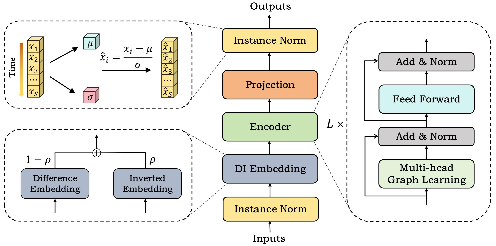
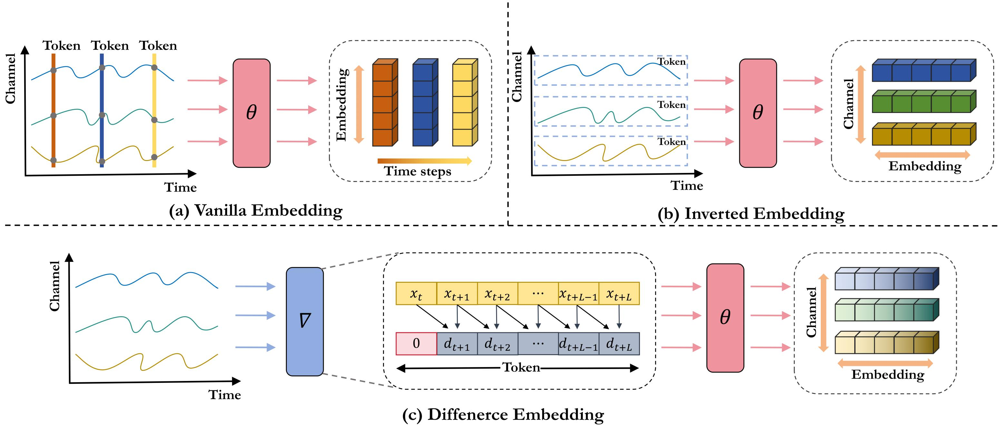
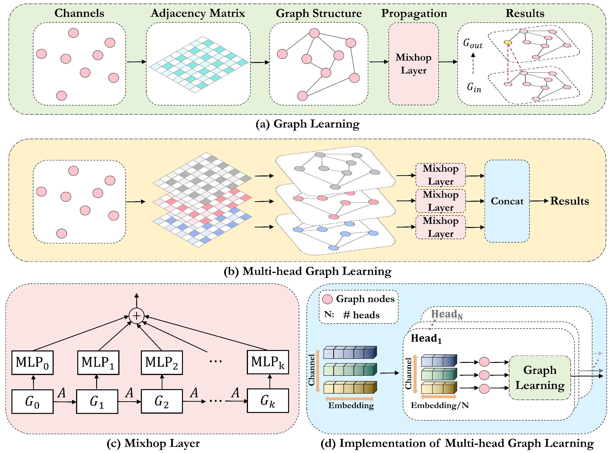
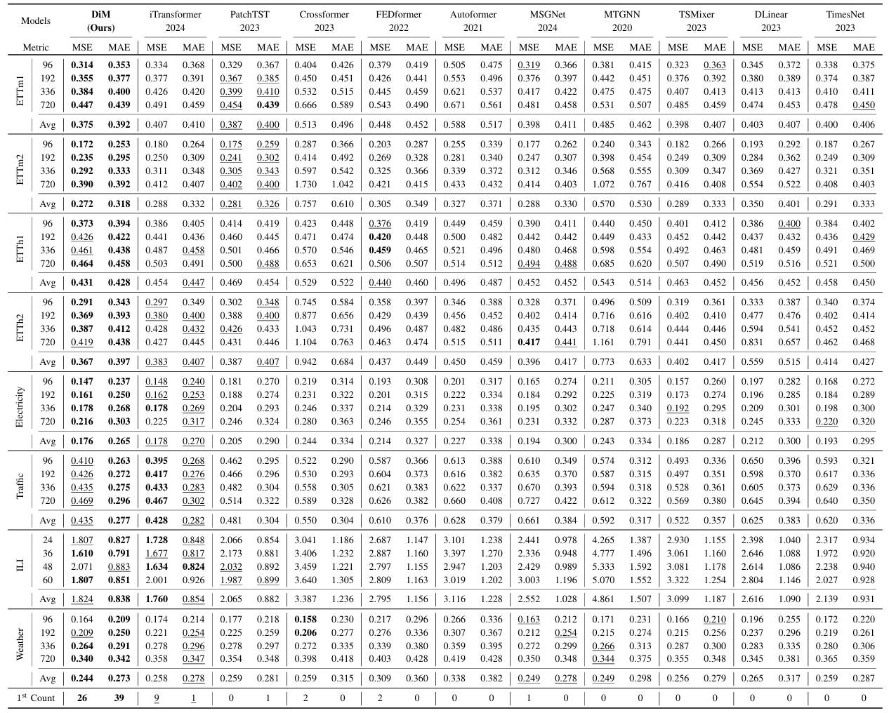

# Introduction
Forecasting multivariate time series (MTS) involves navigating complex temporal dynamics and inter-channel dependencies. Despite advancements in the field, existing methods often fall short in effectively addressing these challenges, leaving significant room for improvement. To tackle these issues, we introduce DiM, a novel approach that integrates a Difference-Inverted (DI) embedding strategy with a multi-head graph learning mechanism, all within the Metaformer framework.

# The model architecture is demonstrated as follows: 



# The difference embedding is shown as follows:


# The multi-head graph learning mechanism is displayed as follows:


# DiM achieves the SOTA performance.



# Usage
## Install Pytorch and other necessary dependencies.
```bash
pip install -r requirements.txt
```
## Datasets
We conducted experiments on various datasets including [Weather](https://www.bgc-jena.mpg.de/wetter/), [Traffic](https://pems.dot.ca.gov/), [Electricity](https://archive.ics.uci.edu/dataset/321/electricityloaddiagrams20112014), [ILI](https://gis.cdc.gov/grasp/fluview/fluportaldashboard.html) and [ETT](https://github.com/zhouhaoyi/ETDataset).
##  Long-term MTS forecasting
```bash
# ETT
bash ./scripts/long_term_forecast/ETT/DiM_ETTh1.sh
bash ./scripts/long_term_forecast/ETT/DiM_ETTh2.sh
bash ./scripts/long_term_forecast/ETT/DiM_ETTm1.sh
bash ./scripts/long_term_forecast/ETT/DiM_ETTm2.sh
```

```bash
# Weather
bash ./scripts/long_term_forecast/Weather/DiM_Weather.sh
```
```bash
# Traffic
bash ./scripts/long_term_forecast/Traffic/DiM_Traffic.sh
```

```bash
# Electricity
bash ./scripts/long_term_forecast/ECL/DiM_ECL.sh
```


## Implementions for other models

For implementions ofother comparative models, please refer to the [Time-Series-Library](https://github.com/thuml/Time-Series-Library/tree/main).
